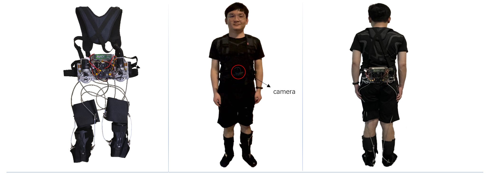
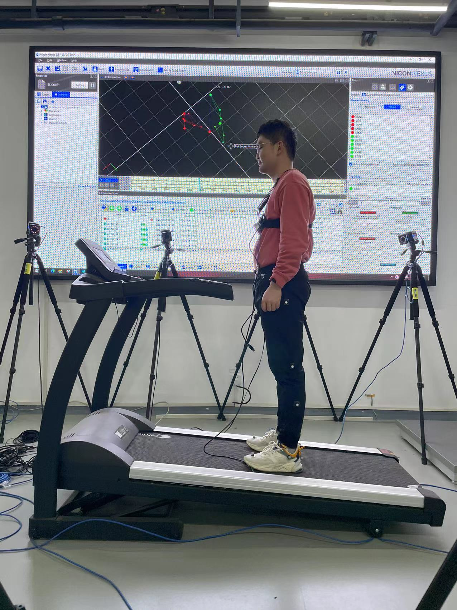
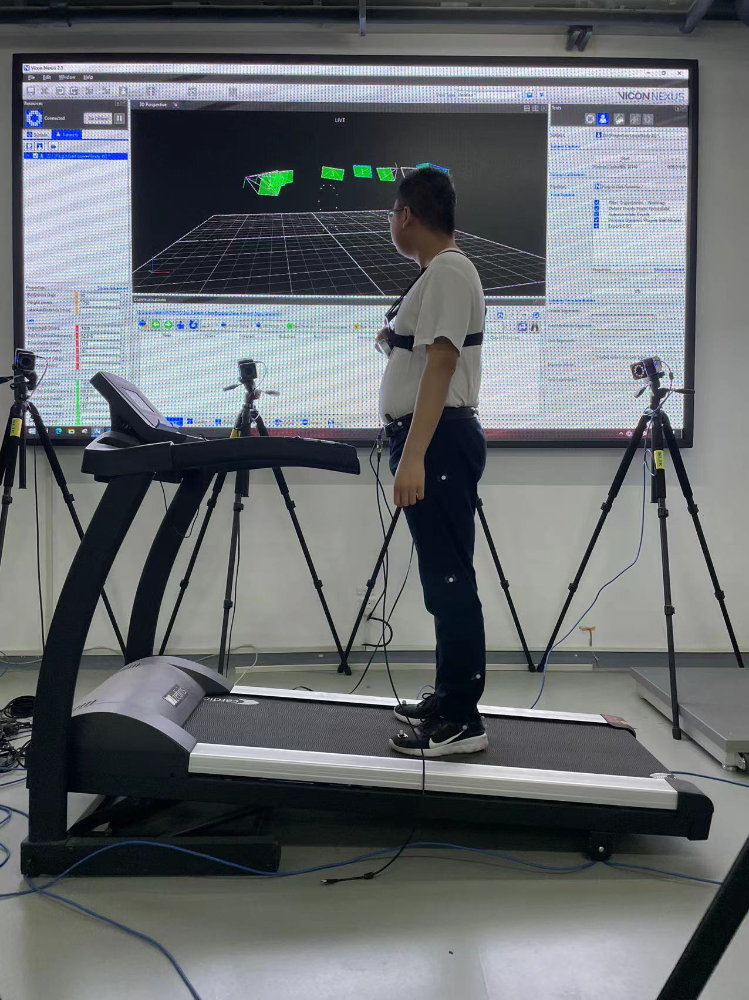
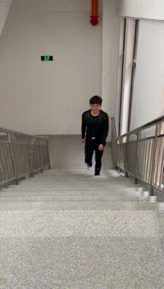
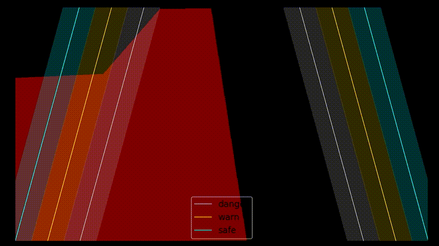
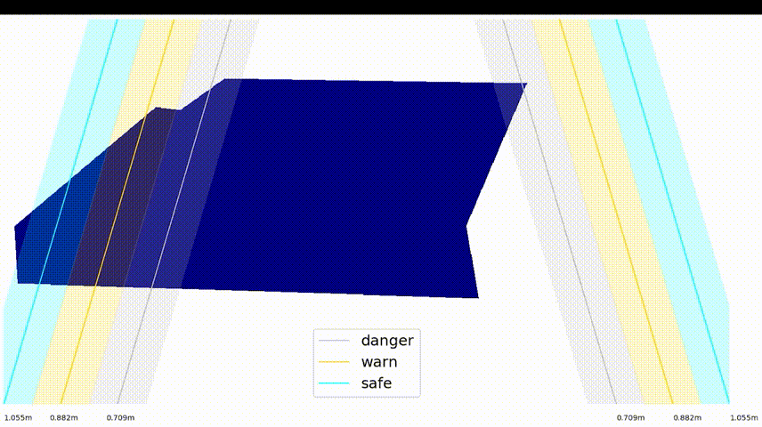

# Visual-perception-control-project-of-Exoskeleton-Robot
* ### Approval department: National Key development plan project of intelligent robot, ministry of science and technology 
of China.
* ### Project Requirement: Design visual perception solutions for exoskeleton robots to improve their multi-terrain adaptation capabilities.
* ### My responsibility: Analyze exoskeleton structure, design visual perception scheme, create multi-terrain image dataset, build semantic segmentation model, test perception effect, combine visual perception with motion control.
* ### Problems & Solutions: The gait of the exoskeleton robot is poorly adapted to multiple terrains. Utilize a semantic segmentation model to perceive the exoskeleton robot's surroundings, and optimize motion control decisions.
* ### Gains: Master PyTorch and Mxnet, dataset construction methods, and robot vision control methods. Apply for an invention patent and a utility model patent. Obtain the grand prize in Silk Road NationalRobotics Competition. Submit a paper.
---

  
  

  
---
  
  
---

  
  

  
---
    
  
---
    
  
---
